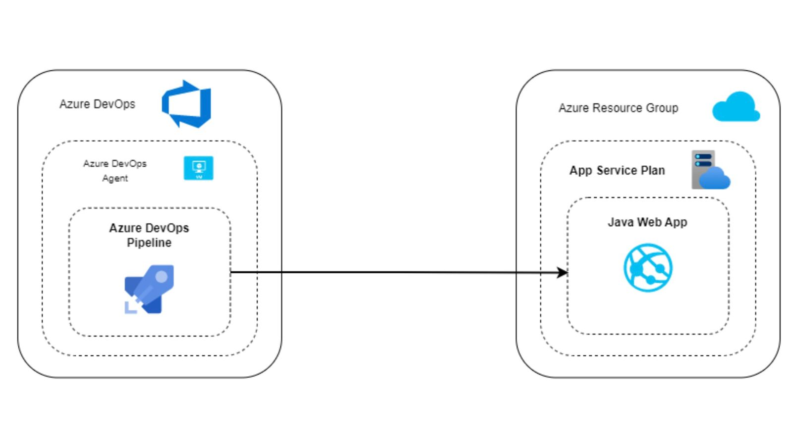

# AppService Infra Setup

## About : 

This project enables users to deploy Appservice on their Azure environment. The project is based on infrastructure as code (IaC).

## Structural definition of the project :
- **Infra/templates**: This folder consists of the bicep template corresponding to Appservice code.
- **Infra/parameters** : This folder contains the parameter files of each environment used by the bicep template to generate the web app.
- **Infra/pipelines** : This folder consists of the deployment pipeline that is responsible for creation of the web app.
- **Infra/variables** : This folder contains the global variables which are not restricted to type of resource and are specific to each environment.

## How to create app service (web app) infra : 
1. Prerequisites : 
    - Azure Subscription
    - Azure Resource Group
    - Azure DevOps Service Connection with spn having required roles on Resource Group
    - Basic understanding of Azure Pipelines, Bicep (IAC).
2. Create the pipeline in Azure DevOps.
3. Run the pipeline: You need to select the environment and provide the name of the app to be created.

## Diagram : 

## Security : 
 1. RBAC (Role Based Access Control): 
    - IAM (Identity and Access Management): Using Microsoft Entra ID (AAD) we can manage access to app service,  based on IAM roles.
    - Using managed identity we can manage app service access to other Azure resources like storage account, Databases without using password.
2. Networking:
    - We can restrict network access to app service using Azure virtual network (Vnet). 
    - **Inbound** traffic can be controlled using private endpoint link (PLE) with PLE subnet NSG (Network security group) 
    - **Outbound** traffic can be controlled using app service vnet integration. Using this we can make traffic to traverse via secured private network instead of public internet.

## FAQ's :  
1. Your Service experiences irregular peak load, how do you address this? 
    - We can solve this issue by using auto scale feature in Appservice.
    - Autoscaling can be configured based on CPU usage and memory usage depending on/ according to peak hours.

2. How do you perform a running deployment without downtime? 
    - We can make use of Blue Green deployment methodology.
    - This can be achieved by using slots in Appservice.

3. How do you handle production monitoring?
    - We can use Azure Monitor feature for monitoring and logging purpose of Appservice.
    - Appinsignts can be configured to view and analyze logs.
    - You can also configure azure alerts based on metrics and custom logs. 

4. How do you deal with errors?
    - We can inspect the pipeline logs in case of failure and figure out the root cause.
    - This can differ for multiple failure causes.

## Remark : 

This project is extendable and reusable depending on the project requirements.